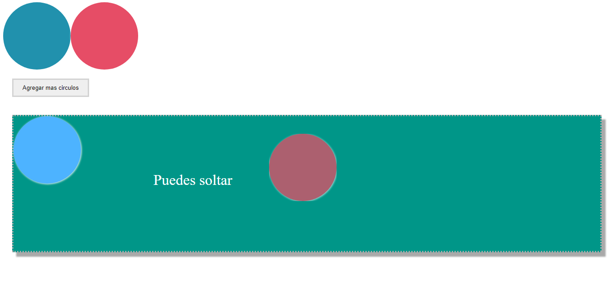

# Drag & Drop

Las interfaces Drag-and-Drop posibilitan arrastrar y soltar archivos en una página web. En este caso se han realizado sin utilizar librerias.

 Este código es parte de un ejercicio de un curso de javascript.
 ##
 